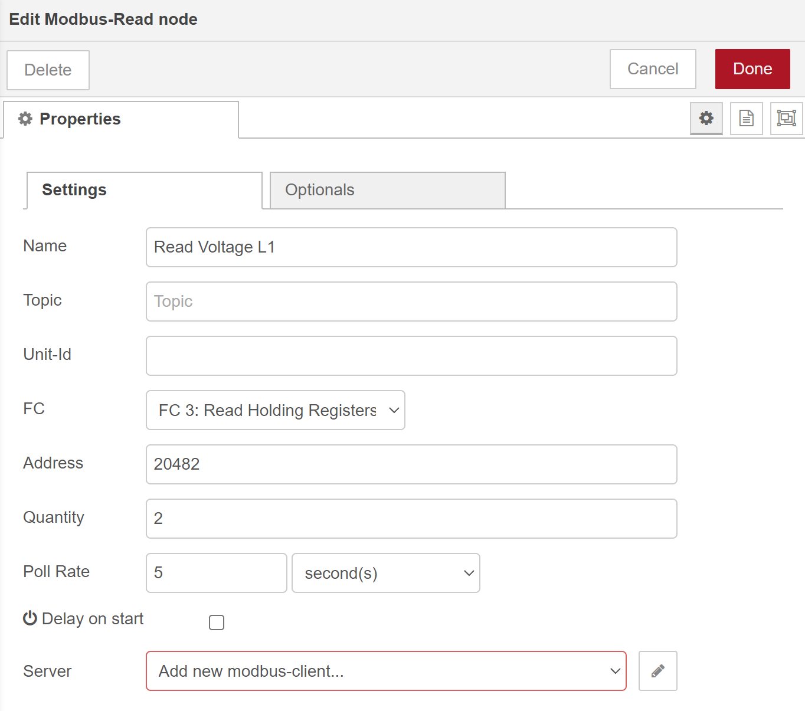

# cc100-serial-communication
This repository shows how the serial interface of the CC100 can be integrated into a Docker container (Node-RED). For this purpose, the WAGO Energy Meter (MID) is connected as an example. The communication between Node-RED and the MID is based on Modbus RTU.

## Prerequisites
* WAGO CC100 (751-9301) => !!! please use Firmware 23 !!!
    - install docker and move docker "DATA-ROOT" to an inserted SD card
    - see [cc100-tutorial](https://www.youtube.com/watch?v=ZIcp3H0h6q0) for help
    - [docker-ipk](https://github.com/WAGO/docker-ipk)
* WAGO Energy Meter (MID) (e.g. 879-3000)
* for firmware download or update see [cc100-firmware](https://github.com/WAGO/cc100-firmware)
* PC with preinstalled SSH Client (e.g. [PuTTY](https://www.putty.org/))
* Web browser of your choice. (e.g. chrome)

## Setup
Connect the terminals X11.1 and X11.2 of the CC100 with the terminals 7 and 8 of the MID

## CC100 Login
Start SSH Client e.g. Putty 
<pre><code>login as 'root'
password 'wago'
</code></pre>

## Check docker installation
<pre><code>docker info
docker ps           # to see all running containers (no container should run)
docker images       # to see all preinstalled images
</code></pre>

## Integration of the serial interface into the Node-RED container
<pre><code>docker run -d \
--name node-red \
--restart always \
--privileged=true \
--user=root \
-p 1880:1880 \
-v node_red_user_data:/data \
-v /dev/ttySTM1:/dev/serial \
wagoautomation/node-red-cc100:1.0.0
</code></pre>

> The serial interface of the CC100 is located on /dev/ttySTM1. By bind-mounting this interface, the Node-RED container gains access to it. In this case /dev/ttySTM1 is replicated to the /dev/serial directory. /dev/serial is created when the container is started. The directory for the volume mount is basically arbitrary, the path must only be passed correctly to Node-RED in the following steps.

## Read MID data via Modbus RTU
1. Open Node-RED by typing **\<ip of your CC100>\:1880** into your browser
2. Drag and drop the **Modbus Read** node into your flow

4. Configure the node as follows

>In this case the voltage of phase L1 is read out as an example. The address is taken from the data sheet of the MID and converted into a decimal value. The **Quantity** is two because the value is stored in two registers.

5. Configure the MID as a new Modbus slave by clicking on the pencil and making the following settings

> For **Serial Port**, enter the path that leads to the directory that was replicated with the Node-RED start command.
> The information about the **Baud rate**, the **Data bits**, the **Stop bits** and the **Parity** was taken from the data sheet of the MID.

6. Connect a debug node to the first output of the modbus read node

7. Deploy the flow
8. Open the debug console

> You can adapt the flow to your needs by reading other registers as well. The addresses of all registers that can be read can be found in the data sheet of the MID. Please note that the addresses for the Modbus read nodes must be specified as decimal values.

## Interpret MID data
1. Install the **node-red-contrib-buffer-parser** lib
2. Use the **buffer parser** node to adjust your flow as follows

3. Edit the node as follows

> The data sheet of the MID shows that the voltage L1 has the data type Float ABCD (Big Endian). Accordingly select the data type float(be).

4. Add another debug node

5. Deploy the flow
6. Open the debug console

## Node-RED flow
You can also import the flow shown above directly. Make sure that the replicated path for the serial port in the Node-RED start command matches the serial port of the Modbus slave in the Modbus Read node.

<pre><code>[
    {
        "id": "2a30359f7d24ebbc",
        "type": "modbus-read",
        "z": "29a2155a87f7168d",
        "name": "Read Voltage L1",
        "topic": "",
        "showStatusActivities": false,
        "logIOActivities": false,
        "showErrors": false,
        "unitid": "",
        "dataType": "HoldingRegister",
        "adr": "20482",
        "quantity": "2",
        "rate": "5",
        "rateUnit": "s",
        "delayOnStart": false,
        "startDelayTime": "",
        "server": "f916ff91cd483ac8",
        "useIOFile": false,
        "ioFile": "",
        "useIOForPayload": false,
        "emptyMsgOnFail": false,
        "x": 180,
        "y": 100,
        "wires": [
            [
                "32398913de4d8fcc",
                "72f25637663dce9b"
            ],
            []
        ]
    },
    {
        "id": "72f25637663dce9b",
        "type": "buffer-parser",
        "z": "29a2155a87f7168d",
        "name": "parse FLOAT ABCD",
        "data": "payload",
        "dataType": "msg",
        "specification": "spec",
        "specificationType": "ui",
        "items": [
            {
                "type": "floatbe",
                "name": "voltage L1",
                "offset": 0,
                "length": 1,
                "offsetbit": 0,
                "scale": "1",
                "mask": ""
            }
        ],
        "swap1": "",
        "swap2": "",
        "swap3": "",
        "swap1Type": "swap",
        "swap2Type": "swap",
        "swap3Type": "swap",
        "msgProperty": "payload",
        "msgPropertyType": "str",
        "resultType": "keyvalue",
        "resultTypeType": "return",
        "multipleResult": false,
        "fanOutMultipleResult": false,
        "setTopic": true,
        "outputs": 1,
        "x": 420,
        "y": 100,
        "wires": [
            [
                "85780372fbcf8928"
            ]
        ]
    },
    {
        "id": "85780372fbcf8928",
        "type": "debug",
        "z": "29a2155a87f7168d",
        "name": "output voltage L1",
        "active": true,
        "tosidebar": true,
        "console": false,
        "tostatus": false,
        "complete": "payload",
        "targetType": "msg",
        "statusVal": "",
        "statusType": "auto",
        "x": 670,
        "y": 100,
        "wires": []
    },
    {
        "id": "32398913de4d8fcc",
        "type": "debug",
        "z": "29a2155a87f7168d",
        "name": "raw data",
        "active": true,
        "tosidebar": true,
        "console": false,
        "tostatus": false,
        "complete": "payload",
        "targetType": "msg",
        "statusVal": "",
        "statusType": "auto",
        "x": 380,
        "y": 60,
        "wires": []
    },
    {
        "id": "f916ff91cd483ac8",
        "type": "modbus-client",
        "name": "MID",
        "clienttype": "serial",
        "bufferCommands": true,
        "stateLogEnabled": false,
        "queueLogEnabled": false,
        "failureLogEnabled": true,
        "tcpHost": "192.168.178.68",
        "tcpPort": "502",
        "tcpType": "DEFAULT",
        "serialPort": "/dev/serial",
        "serialType": "RTU-BUFFERD",
        "serialBaudrate": "9600",
        "serialDatabits": "8",
        "serialStopbits": "1",
        "serialParity": "even",
        "serialConnectionDelay": "100",
        "serialAsciiResponseStartDelimiter": "0x3A",
        "unit_id": "1",
        "commandDelay": "1",
        "clientTimeout": "1000",
        "reconnectOnTimeout": true,
        "reconnectTimeout": "2000",
        "parallelUnitIdsAllowed": true
    }
]
</code></pre>

## Further CC100 projects
* [CC100 video tutorials](https://www.youtube.com/channel/UCV2GhmZPWc5JU73ktI1St4Q/videos)
* [cc100-mid-dashboard](https://github.com/WAGO/cc100-mid-dashboard)
* [cc100-energy-dashboard](https://github.com/WAGO/cc100-energy-dashboard)

## Sources
* [WAGO CC100 data sheet](https://www.wago.com/global/plcs-%E2%80%93-controllers/compact-controller-100/p/751-9301)
* [WAGO Energy Meter (MID) information](https://www.wago.com/global/interface-electronic/discover-current-transformers-voltage-taps/mid-energy-meters)
* [MID data sheet](https://www.wago.com/global/current-transformers-and-voltage-taps/energy-meter-mid/p/879-3000)
